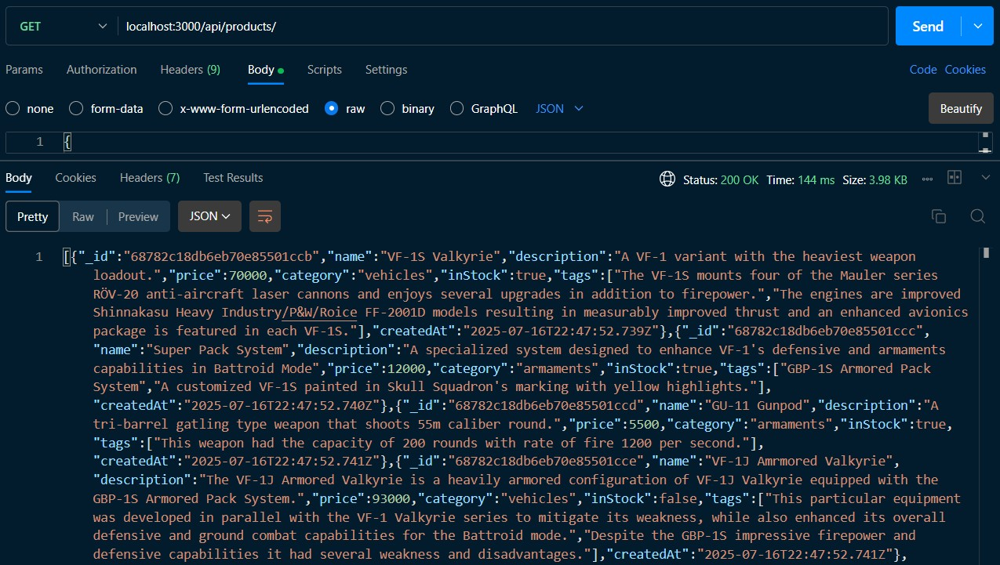
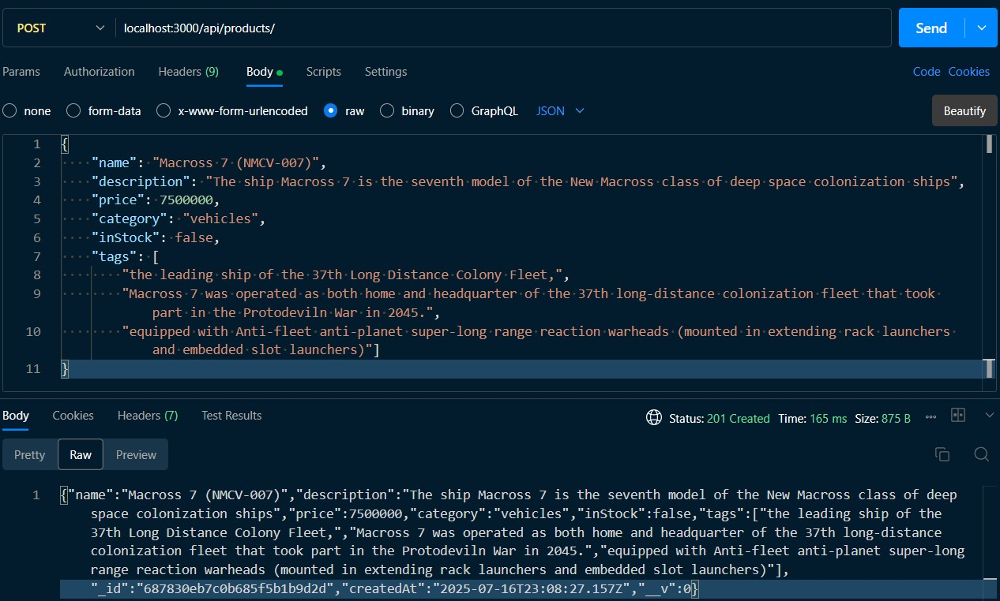
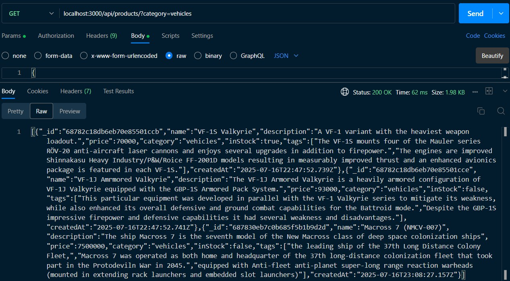

# Mod13 SBA: Build a Product API

This is a solution using Express, MongoDB, and Mongoose to build out [Module 13 SBA](https://ps-lms.vercel.app/curriculum/se/319/sba).  

## Table of contents

- [Overview](#overview)
  - [Key Concepts](#key-concepts)
  - [Screenshot](#screenshot)
  - [Links](#links)
- [My process](#my-process)
  - [Built with](#built-with)
  - [What I learned](#what-i-learned)
  - [Continued development](#continued-development)
  - [Reflections](#reflections)
  - [Useful resources](#useful-resources)
- [Acknowledgments](#acknowledgments)

## Overview

This project follows RESTful API principles to ensure a clean, scalable, and predictable architecture for web services.

### Key Concepts
- Client-Server Separation: The frontend and backend operate independently. Clients interact with the server via clearly defined endpoints (URIs).

- Stateless Requests: Each request includes all necessary information. The server does not remember previous interactions.

- Uniform Interface:
    - Resource-Based URLs: Use nouns to represent resources (e.g., /api/products).

    - HTTP Methods (Full CRUD Implementation):
        - GET: Retrieve data
        - POST: Create new data
        - PUT / PATCH: Update data
        - DELETE: Remove data
        - QUERY: Search and Filter data based on search criteria

    - Standard Format: Data is exchanged in JSON.

Understanding these REST principles is essential before working with or extending this API.

### Screenshot







### Links

- Solution URL: [GitHub: zenith-api](https://github.com/DblRH600/zenith-api?tab=readme-ov-file#screenshot)
- Live Site URL: []()

## My process

### Built with

- NPM
- Node.js
- Express
- DOTENV
- MongoDB
- Mongoose

### What I learned

Building the *Zenith-API* tested my understanding of ***Express***, ***Mongoose***, and how to set up the ***Project Structure & Configuration*** correctly. Additionally, the project further tested my understanding of how to setup ***express.Router()*** routes as well as futher practice with utilizing **try** / **catch** blocks for **error** handling using ***async*** / ***await*** functions and implementing full **CRUD** functions.


```js routes/products.js
/**
 * GET route to query and filter product information
 * @description This route will allow users to query products based on the various schema fields
 */
router.get('/', async (req, res) => {
    const { category, minPrice, maxPrice, sortBy, page = 1, limit = 10 } = req.query

    try {
        const query = {}
        if (category) query.category = category
        if (minPrice) query.price = { ...query.price, $gte: Number(minPrice) }
        if (maxPrice) query.price = { ...query.price, $lte: Number(maxPrice) }

        const sort = {}
        if (sortBy) {
            const [field, order] = sortBy.split('_')
            sort[field] = order === 'asc' ? 1 : -1
        }

        const products = await Product.find(query)
        .select({ __v: 0 })
        .sort(sort)
        .skip((page - 1) * limit)
        .limit(Number(limit))

        res.status(200).json(products)

    } catch (error) {
        res.status(500).json({ message: 'Error fetching products' })
    }
})
```

### Continued development

There is still a *well* of *informaiton* to learn and *apply* regarding the use of **Express**, **MongoDB**, **Mongoose**, and the many functions and performances that can be used in setting up a **server**. Gaining a deeper understanding of full **CRUD** implementation will help with the next phases of ***Full-Stack*** Development; establishing the **Front-End** to **Server** to **DataBase** connection.

### Reflections

### Useful resources

- [EXPRESSJS.COM](https://expressjs.com/en/5x/api.html#res.sendFile) - ***expressjs.com*** contains well documented information details about **routes**.

- [MONGOOSE](https://mongoosejs.com/docs/index.html) - ***mongoosejs.com*** can be used to deepen one's understanding about the functionality **mongoose** is capable of performing that can be incorporated into a **server**.

- [REST API Tutorial](https://restfulapi.net/) - ***restfulapi.net*** provides background information and tutroials on how to build web-based **APIs** (*Application Programming Interfaces*).

- [Blog: How to Build a RESTful API Using Node, Express, and MongoDB](https://www.freecodecamp.org/news/build-a-restful-api-using-node-express-and-mongodb/)

## Acknowledgments
